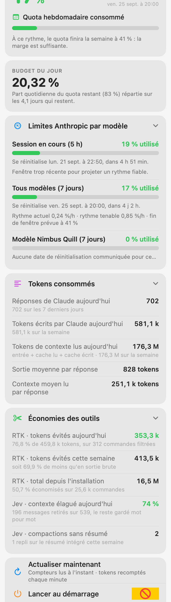

# ClaudeMenu

**A macOS menu bar app that tells you where your Claude usage stands — and whether today's pace gets you to the reset.**


<p align="center">
  
</p>

Two numbers matter when you work with Claude all day: how much of the weekly quota is gone,
and whether the current pace makes it to the reset. Anthropic's own gauge answers the first.
ClaudeMenu answers the second, and adds the exact token counts that the percentages hide.

---

## What it shows

### The headline

The menu bar carries the weekly percentage. Open it and the first card states where the week
lands if nothing changes:

> **17 %** · Quota hebdomadaire consommé
> À ce rythme, le quota finira la semaine à 41 % : la marge est suffisante.
> Réinitialisation dans 4 j 2 h — ven. 25 sept. à 20:00.

Then the daily budget: the remaining quota divided by the remaining days, which is the number
to stay under if you want an even pace.

### Limites Anthropic par modèle

Every meter the API reports, each with its own bar:

| Meter | What it is |
|---|---|
| Session en cours (5 h) | The rolling five-hour window |
| Tous modèles (7 jours) | The weekly quota that actually runs out |
| Modèle *X* (7 jours) | One row per model-specific weekly quota Anthropic exposes |

Each row gives its reset time, the **current rate** in %/h and the **sustainable rate** — the
%/h that would land exactly on 100 at the reset. Compare the two and you know whether to slow
down. A window that has just opened says so instead of extrapolating: 12 % consumed three
minutes into a five-hour window is not a 254 %/h habit.

### Tokens consommés

Percentages tell you how close the limit is, not what you spent. These counts come from your
own transcripts and are exact:

- replies from Claude, today and over the week;
- output tokens written;
- context tokens read (input + cache read + cache write);
- the per-reply averages for both.

### Économies des outils

If the tool is installed, ClaudeMenu shows what it saved you. Nothing appears otherwise.

- **[RTK](https://github.com/vincentlauriat/RTKInfos)** (Rust Token Killer): tokens avoided
  today, this week and since installation, with the percentage and the number of commands
  filtered.
- **[fast-jev-compaction](https://github.com/tamaratran/fast-jev-compaction)**: how much
  context each compaction pruned while keeping the rest verbatim, and how many compactions
  fell back to the built-in summary.

---

## How it gets its data

### The gauge: Anthropic's own numbers

```
GET https://api.anthropic.com/api/oauth/usage
Authorization: Bearer <token>
anthropic-beta: oauth-2025-04-20
```

This is the endpoint Claude Code itself reads, so the percentages match `/usage` exactly. They
are not an estimate or a local reconstruction.

The token is the OAuth access token Claude Code already stores in your login keychain under
`Claude Code-credentials`, read through `/usr/bin/security` — the same tool that wrote it, so
macOS does not raise a second authorisation prompt. ClaudeMenu keeps that token in memory for
the duration of the request and never writes it anywhere. It does not refresh it either: doing
so would mean writing a new token back to the keychain and racing Claude Code for it. An
expired token surfaces as a card telling you to run `claude` once.

The endpoint rate-limits hard, so the gauge is called **at most every three minutes**, with
exponential backoff up to fifteen minutes after a 429. The last good reading stays on screen
and the refresh row says when the next attempt happens.

### The counts: your transcripts

Claude Code writes every session to `~/.claude/projects/**/*.jsonl`. ClaudeMenu reads them
incrementally, from the byte offset it reached last time, so a refresh costs only the lines
appended since. Two details matter for correctness:

- an assistant message is spread over several JSONL lines, one per content block, each
  repeating the same `usage` object — they are de-duplicated by `message.id`;
- only complete lines are consumed, so a half-written last line waits for the next tick.

The weekly window is the seven days before the `all` meter's reset; *today* starts at local
midnight.

### Privacy

Everything stays on your Mac. The only network call is the one above, to Anthropic, with your
own token. No telemetry, no analytics, no third-party service. The transcripts are read, never
sent anywhere.

---

## Install

There is **no tagged release yet**. Build it from source:

```bash
brew install xcodegen
git clone https://github.com/vincentlauriat/ClaudeMenu.git
cd ClaudeMenu
xcodegen generate
xcodebuild -project ClaudeMenu.xcodeproj -scheme ClaudeMenu -configuration Debug \
  -derivedDataPath build CODE_SIGNING_ALLOWED=NO build
open build/Build/Products/Debug/ClaudeMenu.app
```

**Requirements**: macOS 14 or later, Xcode 15 or later, and Claude Code signed in. The gauge
needs a Pro or Max subscription; without one the token counts still work and the meters card
says the gauge is unavailable.

The app has no Dock icon — look for the percentage in the menu bar. If your menu bar is full,
it may be hidden behind the collapse chevron.

---

## Development

### Seeing the panel without clicking the menu bar

```bash
# A regular window, sized to the panel itself
CLAUDEMENU_DEBUG_WINDOW=1 build/Build/Products/Debug/ClaudeMenu.app/Contents/MacOS/ClaudeMenu

# A PNG rendered off screen — reads nothing from the display,
# so it is safe during a call or a screen share
CLAUDEMENU_SNAPSHOT=/tmp/panel.png \
  build/Build/Products/Debug/ClaudeMenu.app/Contents/MacOS/ClaudeMenu

# …in dark mode
CLAUDEMENU_SNAPSHOT_DARK=1 CLAUDEMENU_SNAPSHOT=/tmp/panel-dark.png \
  build/Build/Products/Debug/ClaudeMenu.app/Contents/MacOS/ClaudeMenu
```

`ImageRenderer` does not lay out a `ScrollView`, so the snapshot mode renders the same content
without that container. A blank PNG means that flag was lost.

### Project layout

```
ClaudeMenu/
├── ClaudeMenuApp.swift          MenuBarExtra entry point, debug and snapshot modes
├── Models/UsageModels.swift     Meter, GaugeSnapshot, TranscriptStats, JevWindow
├── Services/
│   ├── CredentialStore.swift    OAuth token from the keychain or the credentials file
│   ├── UsageAPI.swift           /api/oauth/usage client and generic parser
│   ├── TranscriptScanner.swift  incremental JSONL scanner (actor), tokens and Jev notices
│   ├── RTKGain.swift            `rtk gain -d -f json` reader
│   └── UsageMath.swift          pace projections and French formatters
├── ViewModels/UsageViewModel.swift
└── Views/
    ├── Theme.swift              cards, segmented bars, disclosure and info rows
    └── UsagePanelView.swift     the panel
Scripts/                         release.sh, icon and DMG background generators
docs/                            landing page and screenshots
```

[`ARCHITECTURE_EN.md`](ARCHITECTURE_EN.md) has the component table and the design decisions;
[`ARCHITECTURE.md`](ARCHITECTURE.md) is its French mirror.

### Release

```bash
./Scripts/release.sh 1.0.0
```

Builds, signs with a Developer ID, creates `release/ClaudeMenu-<version>.dmg`, notarizes and
staples it.

---

## Known gaps

- No tagged release and no signed DMG yet.
- The app icon is a generated placeholder.
- The interface is French only.
- The panel reads Anthropic's gauge; it cannot show usage for an account you are not signed
  into with Claude Code.

## Related

- [ClaudeSessionView](https://github.com/vincentlauriat/ClaudeSessionView) — a menu bar app
  focused on the raw 5h and 7d windows.
- [ClaudeCodeUsage](https://github.com/vincentlauriat/ClaudeCodeUsage) — a full dashboard for
  local Claude Code usage.
- [RTKInfos](https://github.com/vincentlauriat/RTKInfos) — visualises RTK token savings.

## License

MIT — see [LICENSE](LICENSE).
